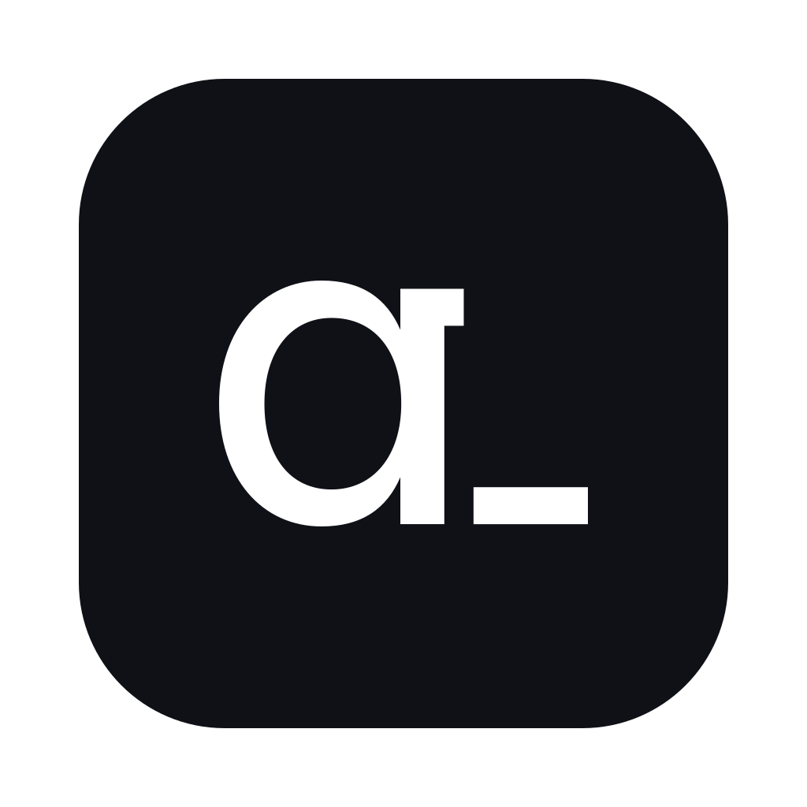
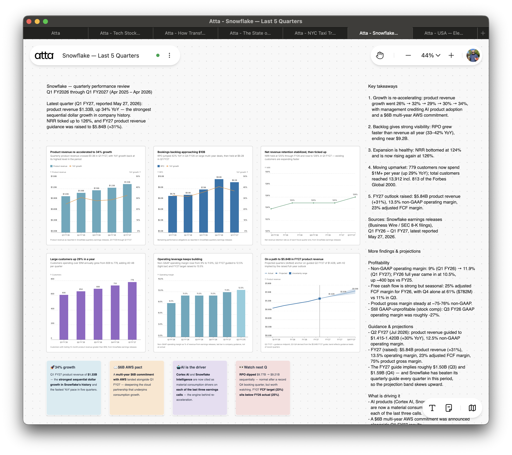

<p align="center">
  
</p>

<h1 align="center">Atta Desktop plugin</h1>

Connect your AI agent to [Atta Desktop](https://atta.app) — a canvas your agent can **read and write to**. Create charts, interactive data apps, and SVG diagrams, run local Python, and lay out an analysis on an infinite canvas, all from a prompt.

Built on the [Agent Plugins](https://agent-plugins.org) open standard, so one install works across Cursor, Claude Code, Codex, VS Code, and other compatible clients.



## How it works

The MCP server is **embedded in the Atta Desktop app** and served on the loopback interface (`http://127.0.0.1:17340/mcp`). Opening a canvas starts it in the background — there is no separate process to launch and no cloud round-trip. Your agent talks to the app running on your machine.

## Prerequisites

- **Atta Desktop**, running with a canvas open. [Download](https://atta.app/downloads).
- One of the supported clients below.

## Install

### Cursor

```
/add-plugin atta-desktop
```

Or search for "Atta" in the Cursor Marketplace. Then check **Cursor Settings → Tools & MCP** for the `atta-desktop` server.

### Claude Code

```
/plugin marketplace add fastview-ai/atta-desktop-plugin
/plugin install atta-desktop@atta
```

Run `/mcp` to confirm the `atta-desktop` server is connected.

### Codex

```
codex plugin marketplace add fastview-ai/atta-desktop-plugin
codex plugin install atta-desktop@atta
```

Or run `/plugins` after adding the marketplace and install `atta-desktop` interactively.

### VS Code / other MCP clients (manual)

Point any MCP client at the local server:

```json
{
  "servers": {
    "atta-desktop": {
      "type": "http",
      "url": "http://127.0.0.1:17340/mcp"
    }
  }
}
```

## Verify

With Atta Desktop open on a canvas, ask your agent to **"create a bar chart of sample data in Atta."** It should ask to use an `atta-desktop` tool and the chart should appear on the canvas.

## What's included

### Tools (MCP)

Canvas: `create_canvas`, `rename_canvas`, `list_open_canvases` · Blocks: `create_chart`, `create_data_app`, `create_svg_block`, `create_text_block`, `create_sticky_note` · Edit: `edit_text_block`, `edit_sticky_note`, `edit_svg_block`, `preview_block`, `bash`, `move_blocks`, `delete_block` · Read: `get_blocks`, `get_block`, `get_selected_blocks` · Other: `run_python`, `export_block`, `pan_to_block`.

Heavyweight guides (chart / data-app / editing references) are served by the app as MCP **resources** (`atta://skill/desktop/...`); load them with `resources/read` before creating a chart or data app.

### Skills

- **ensure-desktop-running** — the gate: make sure the app is running before calling tools.
- **create-chart** — create ECharts visualizations.
- **create-data-app** — create interactive React + Python apps.
- **create-svg** — add frames, arrows, flowcharts, and metric trees.
- **editing-blocks** — refine existing blocks in place (`bash` + `preview_block`, or the dedicated edit tools).

## Troubleshooting

- **Agent says it can't reach the server** — make sure Atta Desktop is open with a canvas, then restart the agent session so it reconnects. Long-running sessions are the most common cause; restarting re-establishes the connection.
- **Wrong port** — the agent port is fixed at `17340`, so the default `mcp.json` should just work. You can confirm the URL in **Settings → Connect AI agent (MCP)**. If it reports the port is in use, another process is holding `127.0.0.1:17340` — free it and relaunch Atta Desktop.
- **Tool-call errors** — LLMs can occasionally get tool parameters wrong; retry, or restart the session.

## Local development

Cursor rejects a local plugin whose directory is a symlink pointing outside `~/.cursor/plugins/local`, so a local install must be a real copy:

```sh
make install-local     # copy this repo into ~/.cursor/plugins/local/atta-desktop
make uninstall-local   # remove it
```

Re-run `make install-local` after editing the plugin, then reload Cursor (**Developer: Reload Window**) if it doesn't refresh automatically.

## The standard

This plugin follows [Agent Plugins 1.0](https://agent-plugins.org): a root `plugin.json` manifest, an `mcp.json` MCP configuration, and portable skills under `skills/`. That portable core is what loads across every compatible client.

For richer marketplace listings (logo, screenshots, categories) it also ships per-client manifests, since the Agent Plugins manifest is intentionally minimal and carries no branding:

- `.cursor-plugin/plugin.json` — Cursor listing (logo, display name)
- `.codex-plugin/plugin.json` — Codex listing (logo, screenshots, category)
- `.claude-plugin/{plugin,marketplace}.json` — Claude Code (not yet on the standard)
- `.agents/plugins/marketplace.json` — Codex `plugin marketplace add`

All of them reuse the same shared `mcp.json` and `skills/`.

## License

MIT — see [LICENSE](./LICENSE).
